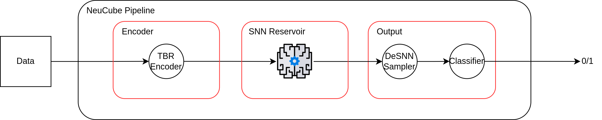

# scikit-neucube

**Scikit-neucube** is a fork of the [NeuCube-Py](https://github.com/KEDRI-AUT/NeuCube-Py) library, a Python implementation of the [NeuCube](https://kedri.aut.ac.nz/research-groups/neucube) framework, that aims at lowering the barrier of entry to experimenting with Spiking Neural Networks (SNN) and NeuCube by adhering to the scikit-learn API, an interface familiar to ML practitioners.

## Features

* Scikit-learn compatible
* Alternative implementations of select algorithms involved in reservoir-based SNNs
    * Threshold-Based Representation (TBR) Encoder
    * Small-World Connectivity (SWC)
    * Dynamically Evolving Spiking Neural Network (DeSNN) sampler
* New visualization methods
* Compatibility with libraries that support scikit-learn

## Installation

To install scikit-neucube, you can clone this repository:

```bash
git clone https://github.com/Torx402/NeuCube-Py
```

or pip install:

```bash
pip install git+https://github.com/Torx402/NeuCube-Py.git
```

### Dependencies

Scikit-neucube requires the following:
* Python (>= 3.12.5)
* PyTorch (>= 2.5.1)
* scikit-learn (>= 1.5.1)
* NumPy (>= 2.0.1)
* Tqdm (>= 4.67.1)
* Pandas (>= 2.2.2)
* Matplotlib (>= 3.9.1)

## Usage

The main idea behind scikit-neucube is that each component involved in the NeuCube framework can be treated as a scikit-learn transformer, therefore, one can think of a solution that uses NeuCube as a pipeline consisting of sequential steps. This was inspired by the custom `Pipeline` class implemented in NeuCube-Py and the idea "why not make the whole thing compatible with scikit-learn?". Visually, the structure of a NeuCube pipeline for classifying spatio-temporal data with binary labels is presented in the following diagram:



Which can be built in the following manner:
```python
from neucube import Reservoir
from neucube.encoder import TBR
from neucube.sampler import DeSNN
from sklearn.pipeline import Pipeline
from sklearn.linear_model import LogisticRegression

# Build a pipeline consisting of sequential transformers
neucube_pipe = Pipeline(steps=[
    ('Encoder', TBR()),
    ('Reservoir', Reservoir()),
    ('Sampler', DeSNN()),
    ('Classifier', LogisticRegression())
])

# fit_transform the pipeline to training data
neucube_pipe.fit_transform(X_train, y_train)

# Use the pipeline for prediction
y_pred = neucube_pipe.predict(X_test)
```

Compatibility with scikit-learn simplifies the steps involved in building a SNN solution using NeuCube. Hyperparameter optimization and setting selection can be done using modules offered by scikit-learn such as grid search and/or cross-validation.

## Development and Contribution

Since this is an ongoing project and is just starting to take its baby steps, any and all contributions, comments, notes, reservations, criticisms and the like are more than welcome and will be highly appreciated. 

In the meantime, you (and I just as much) may refer to the scikit-learn [Development Guide](https://github.com/scikit-learn/scikit-learn?tab=readme-ov-file#development) for contribution and development guidelines.

## License

As per the NeuCube-Py license, scikit-neucube is licensed under the [GNU AGPLv3](LICENSE.md) license.

## Acknowledgments

Scikit-neucube builds on the work done as part of Neucube-Py and by extension upon the original NeuCube model developed at KEDRI Auckland University of Technology, New Zealand. Thus, each party's respective contributions to the field of spiking neural networks and their research are acknowledged and appreciated.

This project spawned as part of my Bachelor's Thesis under the supervision of Dr. [Piotr Maciąg](https://repo.pw.edu.pl/info/author/WUT6986530ab8b1400d99b691db43229d90?r=author&tab=&title=Person%2Bprofile%2B%25E2%2580%2593%2BPiotr%2BMaci%25C4%2585g%2B%25E2%2580%2593%2BWarsaw%2BUniversity%2Bof%2BTechnology&lang=en), his guidance was a crucial contribution.

## References

For more information about the NeuCube algorithm and related research papers, please refer to the following publications:

- Original Neucube Paper: [NeuCube: A spiking neural network architecture for mapping, learning and understanding of spatio-temporal brain data](https://www.sciencedirect.com/science/article/abs/pii/S0893608014000070)
- Additional Research Papers: [List of Neucube-related publications](https://kedri.aut.ac.nz/our-projects/publications)
